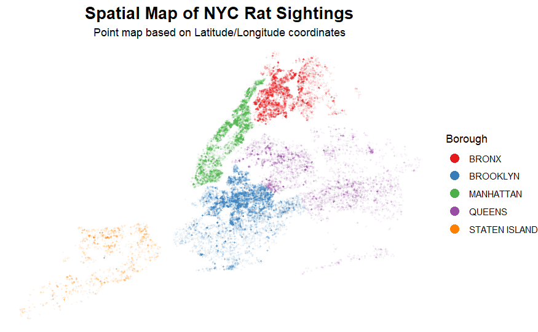
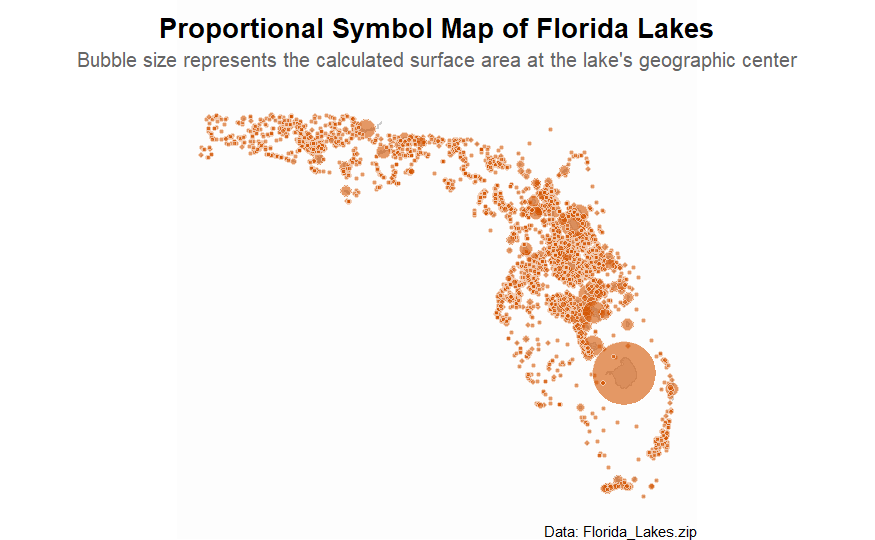
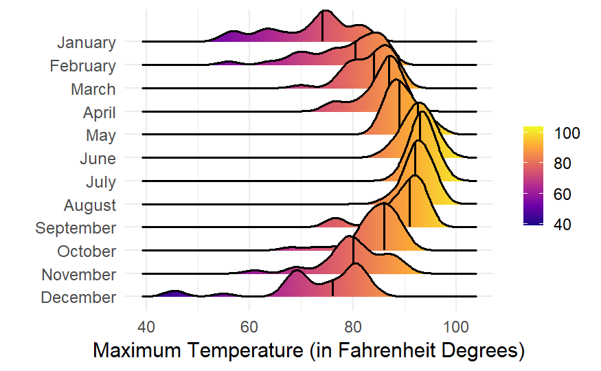

# Data Visualization and Reproducible Research

> Logan Morrison. 

The following is a sample of products created during the _"Data Visualization and Reproducible Research"_ course.

## Project 01

In the `project_01/` folder you can find a an exploration of rat sightings in New York City, visualized through spatial maps. 

## Project 02

In this project, I explored factors impacting the values of housing in West Roxbury, as well as explored the surface areas of various lakes in Florida. Find the code and report in the `project_02/` folder.

## Project 03

In this project, I explored weather data from Tampa International Airport. Furthermore, I also explored the most common words in the lyrics of songs in the Billboard top 100.

### Moving Forward

This course has impressed upon me the critical importance of the balance between technical precision and clear storytelling. By refining small details like theme borders and density bandwidth, I have seen how minor adjustments directly improve data legibility. In the future I plan to further my expertise by moving beyond static visualizations, exploring interactive platforms like Shiny and narrative-driven tools like Quarto, to ensure data insights are not only accurate and visually pleasing, but also engaging and accessible to broader audiences.
